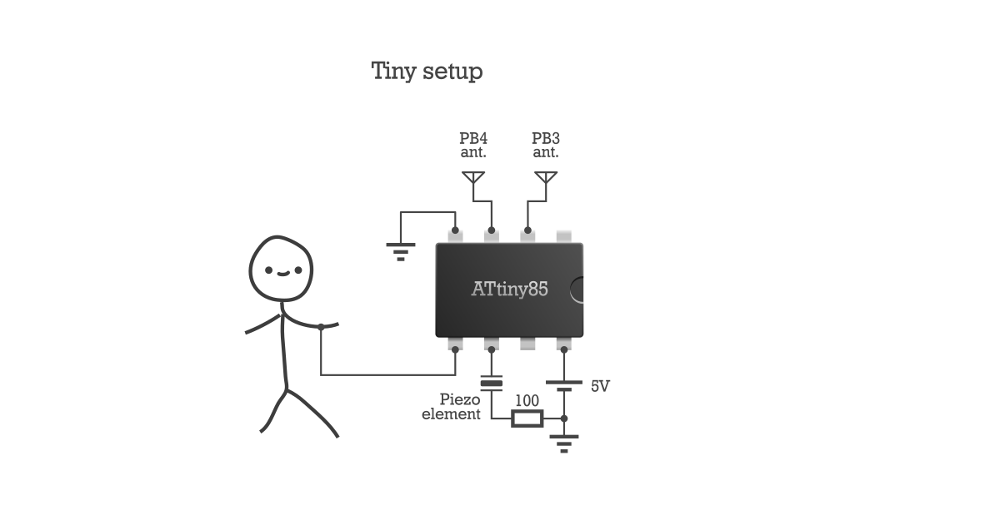
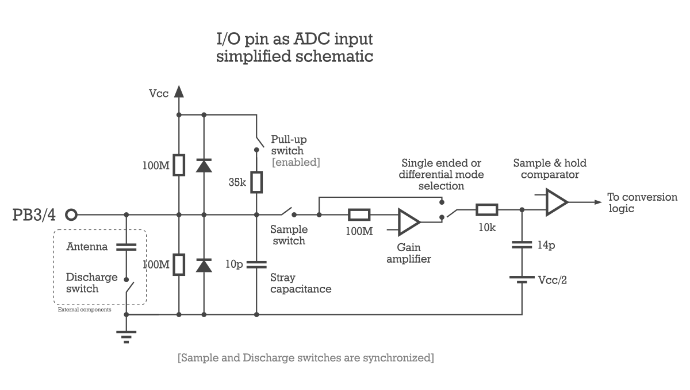
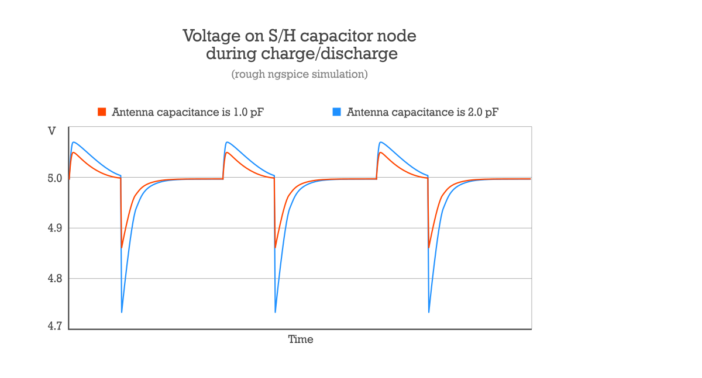
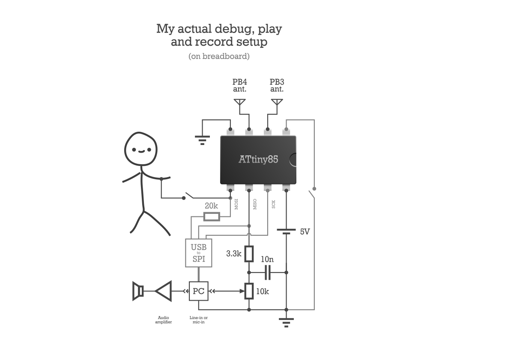

A Tiny Theremin
===============

This project was inspired by [Tim's Tiny Theremin](https://mitxela.com/projects/a_tiny_theremin).

A tiny theremin with only one component — Atmel **ATtiny85** 8-bit microcontroller.

To make the theremin you will need (at least):

- ATtiny85, ATtiny45 or similar microcontroller,
- three pieces of a wire: 2 for each antenna and another 1 for a "wrist strap",
- some audio interface (e.g. a piezo element plus 100+ Ohm resistor),

along with a 5 volts power source, facilities to flash the controller (AVR programmer)
and a breadboard or some more wires plus soldering iron.

Here's the connection diagram:

For those, who are brave enough to hear me playing it
(real guitar as an accompaniment plus some reverb):

[audio/ryabina.mp3](https://github.com/anonymou8/TinyTheremin/blob/main/audio/ryabina.mp3)

Clean full range record:

[audio/clean.mp3](https://github.com/anonymou8/TinyTheremin/blob/main/audio/clean.mp3)

How it works
------------

The principle is simple. Pin stray capacitance is getting charged to 5 volts over
pin's pull-up resistor during non-sampling ADC period (most of the time). Then,
in sync with sampling time, while pull-up resistor stays enabled, everything
is getting discharged by a discharge pulse coming from other pin, directly connected
to human body. The human-antenna capacitance determines discharge level of the stray
capacitance.

The more human-antenna capacitance (closer to antenna), the deeper stray capacitance
gets discharged.

Pull-up resistor decreases input impedance, which helps against mains EMI.

Here's the schematic of a pin connected to the ADC peripherals:

And here's the simulation of how voltage on the ADC's sample and hold
capacitor behaves during dischage pulses, depending on the antenna capacitance.

Differential input mode of ADC, along with programmable gain, makes it really
easy to measure tiny voltage changes, especially when internal 1.1V source
is selected as a reference. But actual measurements are very noisy,
considering their digital nature, so they are highly filtered (averaged)
before passing for subsequent processing.

Building
--------

Code is written using [GNU Assembler](https://www.gnu.org/software/binutils/) for AVR.
To build it you need `avr-gcc` or `avr-binutils` to be installed. On a Unix-like system run

    ./build theremin

You should get `theremin.bin` file, which has to be flashed onto an ATtiny85.

Low fuse byte must be programmed to: `11100001` (16 MHz clock from PLL).

Tuning and debugging
--------------------

Every instrument is different and has to be tuned before playing.
For the Tiny Theremin it is not so simple.

You must have some SPI on your PC to connect to an ATtiny85 and
to read ADC data it sends. For this purpose a special piece of code
is used. The program is intended only for debugging and tuning.
To build it run

    ./build tune_spi

You should get `tune_spi.bin` file, which has to be flashed onto an ATtiny85.

After flashing, with each byte read from an MCU you will alternately
get an averaged ADC value from each of two antennas. A simple console
Python script for displaying the data is provided.

Take a look at another files in the `scripts` folder as well as the
assembler sources.

 
